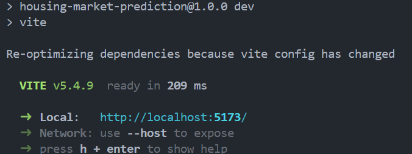

# React + Vite
# Housing Market Prediction - TeamName (Students e.g Armin, etc.)

*project description here*

## Project Structure

```
.
├── backend/
├── frontend/
└── README.md
```

## Setup and Installation

### Backend

1. Create and activate a virtual environment:

   **Linux/macOS:**
   ```
   python3 -m venv myenv
   source myenv/bin/activate
   ```

   **Windows:**
   ```
   py -m venv myenv
   .\myenv\Scripts\activate
   ```

2. Install requirements:
   ```
   pip install -r requirements.txt
   ```

3. Run the app:
   - For production on only Linux VPS (assuming gunicorn is installed):
     ```
     gunicorn app:app
     ```
   - For local testing:
     ```
     python3 app.py
     ```

4. Note the port and address where the app is running. e.g http://127.0.0.1:5000


### Frontend

1. Navigate to the frontend directory:
   ```
   cd frontend
   ```

2. Set up the environment:
   - Set the API URL inside `.env`:
     ```
     VITE_API_URL=http://your-api-url
     ```
     For example:
     ```
     VITE_API_URL=http://127.0.0.1:5000
     ```

3. Install dependencies and run the development server:
   ```
   npm install
   npm run dev
   ```
   then open up the localhost url you see in the terminal to see the website e.g http://localhost:5173/

   if the react app is suucessfully running you will see something like:

   


## Usage
After successfully doing all the steps you can now use the website to see predictions.


This template provides a minimal setup to get React working in Vite with HMR and some ESLint rules.

Currently, two official plugins are available:

- [@vitejs/plugin-react](https://github.com/vitejs/vite-plugin-react/blob/main/packages/plugin-react/README.md) uses [Babel](https://babeljs.io/) for Fast Refresh
- [@vitejs/plugin-react-swc](https://github.com/vitejs/vite-plugin-react-swc) uses [SWC](https://swc.rs/) for Fast Refresh
